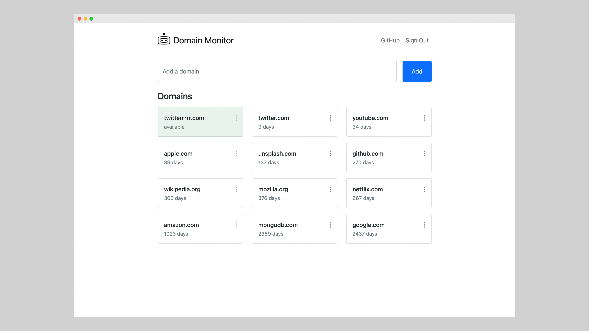

# Domain Monitor

Domain Monitor is a React single-page application for tracking domain status changes.

 

## Hosting on MongoDB Cloud

### Requirements

Node.js is required to build the application and then deploy it to the cloud using the Realm CLI. If you
don't have it already, please download it from [here](https://nodejs.org/en/download/).

MongoDB Cloud account is required to access MongoDB Atlas and MongoDB Realm. MongoDB Atlas is for hosting
the application's database, and MongoDB Realm is for hosting serverless functions and static files. Static files can be
hosted anywhere else, but I recommend using MongoDB Realm just for simplicity. Create MongoDB Cloud
account [here](https://www.mongodb.com/cloud/atlas/register).

The application can be deployed to MongoDB Cloud using the Realm UI, but a more convenient way is to
use the Realm CLI. You can find how to install and configure the Realm CLI [here](https://docs.mongodb.com/realm/cli/).

An SMTP server is an optional requirement to receive email notifications when domain status is changed.

### Create Atlas Cluster

[Here](https://docs.atlas.mongodb.com/tutorial/deploy-free-tier-cluster/) is an excellent guide on how to create a
MongoDB cluster.

Be advised that a free-tier cluster is more than enough for this application.

### Create Realm Application

Once you have finished creating the Atlas Cluster, click on the Realm tab.

Inside the Realm tab, a popup with a list of available application templates will appear. Select the "Build your own
App" template and click Next.

In the next step, make sure that the application links to your freshly created Atlas cluster. You can also change the
application name or the region where it will be deployed.

Once the application is created, copy its ID. You will need it later.

#### Enable Hosting

While still inside the Realm UI, navigate to the Hosting page, which can be found inside the left navigation menu. On
the Hosting page, click the Enable Hosting button.

### Deploy to Realm

Check out the project repository:

```shell
git clone git@github.com:tunaitis/domain-monitor.git && cd domain-monitor
```

Build the application using the command below. Don't forget to replace the <Your App ID> with the actual application ID
from the previous step.

```shell
REACT_APP_REALM_APP_ID="<Your App ID>" npm run build
```

Now you're ready to deploy the application to the MongoDB Cloud. 

```shell
realm-cli push \
  --include-package-json \
  --include-hosting \
  --local="backend" \
  --remote="<Your App ID>"
```

That's it! You will be able to access your freshly deployed application as soon as MongoDB Realm finishes provisioning
hosting. By default, the application will be available at a domain with the following form:

```
https://<Your App ID>.mongodbstitch.com/
```

You can assign a custom domain name to it in the Hosting settings page from the Realm UI.

### Application Settings

Application settings can be managed from the Values page inside the Realm UI.

|Name|Default|Description|
|---|---|---|
|registrationEnabled|true|Control whether users can sign up for an account using the registration form. Even when the registration is disabled, you can still create a new user account using the Realm UI. More about it [here](https://docs.mongodb.com/realm/users/create/).|
|smtpHost| |Hostname or IP address to connect to.|
|smtpUser| |Username to use when connecting to the SMTP server.|
|smtpPassword| |Password for the user when connecting to the SMTP server.|
|smtpFrom| |Email address of the sender.|

## Credits

Logo icon is by [Andrejs Kirma](https://thenounproject.com/andrejs/) from [NounProject.com](https://thenounproject.com/).
  
## License
  
The Domain Monitor is free and open-source software licensed under the [Apache License 2.0](https://github.com/tunaitis/domain-monitor/blob/master/LICENSE).
